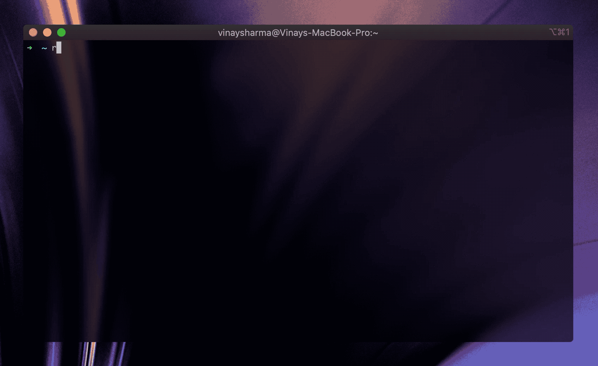
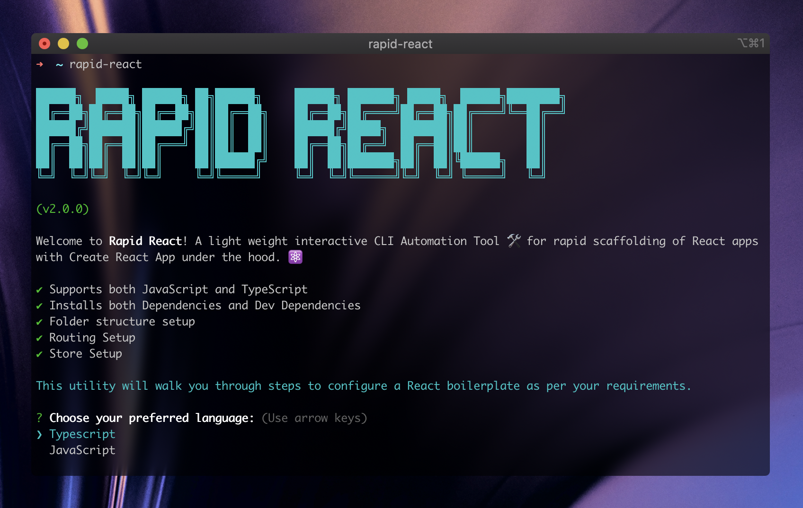
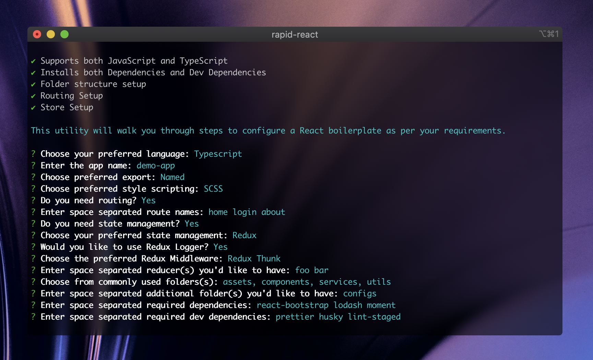

<h1 align="center">
  React JS CLI :hammer_and_wrench:
</h1>

<h4 align="center">
  A light weight interactive CLI Automation Tool :hammer_and_wrench: to scaffold React apps quickly using
  <a href="https://create-react-app.dev/" target="_blank">Create React App</a> under the hood. :atom:
</h4>

<p align="center">
  Built with :heart: by <a href="https://www.linkedin.com/in/vinaysharma-/" target="_blank">Vinay</a>.
</p>

<p align="center">
  <a href="#about-information_source">About</a> •
  <a href="#features-tada">Features</a> •
  <a href="#requirements-white_check_mark">Requirements</a> •
  <a href="#installation-rocket">Installation</a> •
  <a href="#documentation-green_book">Documentation</a> •
  <a href="#contributing-handshake">Contributing</a> •
  <a href="#license-page_facing_up">License</a>
</p>



## About :information_source:

<a href="https://github.com/vinaysharma14/react-js-cli" target="_blank">React JS CLI</a> is an interactive CLI tool which automates the repetitive steps involved every time a new React app is setup. Usually developers :man_technologist: go through a time consuming process which involves waiting for **create-react-app** to finish it's boilerplate setup, followed by installation of dependencies & dev dependencies, setup of folder structure, routing, state management, e.t.c. before it can finally start working on the app. :construction:

Well, now you can grab a cup of :coffee: while **React JS CLI** scaffolds the app for you! :relieved:

## Features :tada:

- Supports both [JavaScript](https://www.w3schools.com/js/) and [TypeScript](https://www.typescriptlang.org/). :heart_eyes:
- Installs both dependencies and dev dependencies.
- Supports popularly used CSS preprocessor [SASS](https://sass-lang.com/)! :fire:
- Choose from commonly used folders (`assets`, `components`, `hooks`, `services`, `utils`, e.t.c.) to scaffold.
- Scaffolds custom folder as well.
- Choose preferred [export type](https://developer.mozilla.org/en-US/docs/web/javascript/reference/statements/export): named/default. :thinking:
- Setups [routing](https://reactrouter.com/) with user defined routes.
- Setups [Redux](https://react-redux.js.org/) state management with user defined reducers along with:
  - [Redux Saga](https://redux-saga.js.org/)
  - [Redux Form](https://redux-form.com/)
  - [Redux Logger](https://github.com/LogRocket/redux-logger#readme)
- Setups [MobX](https://mobx.js.org/README.html) state management with user defined stores.
- ...and much more! :tada:

## Requirements :white_check_mark:

- [Node.js](https://nodejs.org/en/download/) installed on your system.
- An active internet connection for CLI to work.

## Installation :rocket:

From your terminal run:

```bash
# install the package from NPM
$ npm install react-js-cli
```

## Documentation :green_book:

**React JS CLI** installs `react` command in your system. To run the tool, you need to invoke this command from your terminal:

```bash
# that's it!
$ react
```

As soon as run the command you are greeted by the CLI.



From there on, you are asked a couple of question for a tailored experience for your app setup.



The utility would walk you through from following:

- **Language Preference**<br>
  Choose between JavaScript and TypeScript

- **App Name** <br>
  Enter your app name. By default it fallbacks to _my-app_.<br>

  :white_check_mark: valid app names<br>
  foo<br>
  123foo<br>
  foo123<br>
  foo-bar<br>

  :x: invalid app names<br>
  Foo<br>
  Foo-Bar<br>
  FooBar<br>

- **Export Type Preference**<br>
  Choose between Named and Default.

- **StyleSheet Preference**<br>
  Choose between CSS and SCSS.

- **Routing requirement**<br>
  Choose either Yes or No.

  - **If required, enter space separated route names**<br>
    e.g. `home login about signIn signUp`

    :white_check_mark: valid route names<br>
    foo<br>
    fooBar<br>
    FooBar<br>
    Foo123<br>

    :x: invalid route names<br>
    123foo<br>
    foo-bar<br>
    foo.bar<br>
    foo?bar<br>

- **State management requirement**<br>
  Choose either Yes or No.

  - **If required, select one**<br>
    Choose between MobX and Redux. Once chosen you'll be prompted to **enter space separated** names of stores(in case of MobX) or reducers(in case of Redux). The conventions would be same as routes.

  - **Installing additional Redux libraries**<br>
    If you chose Redux you'll be prompted to choose from these additional libraries usually needed with Redux:
    - Redux Form
    - Redux Logger
    - Redux Saga (plus, you can **enter space separated** sagas as well)

- **Scaffold folders**:

  - **Standard**<br>
    You can choose from commonly used folder to scaffold: `assets`, `components`, `data`, `errors`, `fallbacks`, `hooks`, `layouts`, `services`, `types`, `utils`, `validations`.
  - **Custom**<br>
    You can **enter space separated** folders. The conventions would be same as routes.

- **Dependencies**:<br>
  You can **enter space separated** dependencies. The conventions would be same as routes. E.g. `antd lodash moment`.<br>
  :warning: In case you are using **TypeScript** you'll have to explicitly mention type definition packages required for these dependencies. Such packages usually start with `@types/` prefix and are installed as dev dependencies.

- **Dev Dependencies**:
  You can **enter space separated** dev dependencies. The conventions would be same as routes. If you're not sure about what a dev dependency is, you can refer to [this](https://stackoverflow.com/a/22004559/11220479).

## Contributing :handshake:

Your contributions are always welcome! Please have a look at the [contribution guidelines](https://github.com/vinaysharma14/react-js-cli/blob/master/CONTRIBUTING.md) first. 🎉

## License :page_facing_up:

**React JS CLI** is licensed under the terms of [MIT License](https://github.com/vinaysharma14/react-js-cli/blob/master/LICENSE.md).
